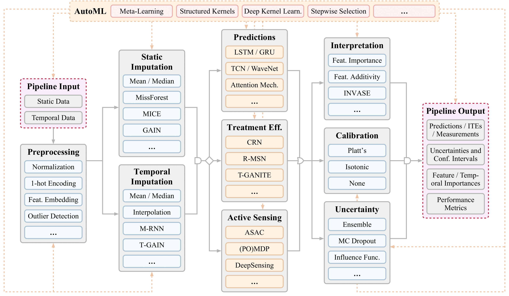

# Codebase for "Clairvoyance: a Unified, End-to-End AutoML Pipeline for Medical Time Series"

{:height="50px" width="200px"}

Authors: ML-AIM (www.vanderschaar-lab.com)

This directory contains implementations of Clairvoyance: a unified, end-to-end AutoML 
pipeline for medical time series for the following applications.

-   Time-series prediction (one-shot and online)
-   Transfer learning
-   Individualized time-series treatment effects (ITE) estimation
-   Active sensing on time-series data

All API files for those applications can be found in api folder. 
All tutorials for those applications can be found in tutorial folder.
app.py contains web-based clinical decision support system.



## Example: Time-series prediction 

To run the pipeline for training and evaluation on time-series 
prediction framwork, simply run python3 -m api/main_api_prediction.py or take a look 
at the following jupyter-notebook file (tutorial/tutorial_prediction.ipynb).

Note that any model architecture can be used as the predictor model such as
RNN, Temporal convolutions, and transformer. The condition for
predictor model is to have fit and predict functions as its subfunctions.

## Stages of the time-series prediction:

-   Import dataset
-   Preprocess data
-   Define the problem (feature, label, etc.)
-   Impute missing components
-   Select the relevant features
-   Train time-series predictive model
-   Estimate the uncertainty of the predictions
-   Interpret the predictions
-   Evaluate the time-series prediction performance on the testing set
-   Visualize the outputs (performance, predictions, uncertainties, and interpretations)

### Command inputs:

-   data_names: mimic, ward, cf    

-   normalization: minmax, standard, None
-   one_hot_encoding: input features that need to be one-hot encoded
-   problem: 'one-shot' or 'online'
-   max_seq_len: maximum sequence length after padding
-   label_name: the column name for the label(s)
-   treatment: the column name for treatments
      
-   static_imputation_model: mean, median, mice, missforest, knn, gain
-   temporal_imputation_model: mean, median, linear, quadratic, cubic, spline, mrnn, tgain
            
-   feature_selection_model: greedy-addtion, greedy-deletion, recursive-addition, recursive-deletion, None
-   feature_number: selected featuer number
      
-   model_name: rnn, gru, lstm, attention, tcn, transformer
-   h_dim: hidden dimensions
-   n_layer: layer number
-   n_head: head number (only for transformer model)
-   batch_size: number of samples in mini-batch
-   epochs: number of epochs
-   learning_rate: learning rate
-   static_mode: how to utilize static features (concatenate or None)
-   time_mode: how to utilize time information (concatenate or None)
-   task: classification or regression
      
-   uncertainty_model_name: uncertainty estimation model name (ensemble)
-   interpretor_model_name: interpretation model name (tinvase)
-   metric_name: auc, apr, mae, mse


### Example command

```shell
$ cd api && python3 main_api_prediction.py
--data_name cf --normalization minmax --one_hot_encoding admission_type
--problem one-shot --max_seq_len 24 --label_name death
--static_imputation_model median --temporal_imputation_model median
--model_name lstm --h_dim 100 --n_layer 2 --n_head 2 --batch_size 400
--epochs 20 --learning_rate 0.001 
--static_mode concatenate --time_mode concatenate
--task classification --uncertainty_model_name ensemble
--interpretation_model_name tinvase --metric_name auc && cd ..
```

### Outputs

-   Model prediction
-   Model performance
-   Prediction uncertainty
-   Prediction interpretation

### Extract data from MIMIC III
To be able to run the following script, you need to get access to MIMIC III and follow the instructions for installing it in a Postgres database: https://mimic.physionet.org/tutorials/install-mimic-locally-ubuntu/
```shell
$ cd datasets/mimic_data_extraction && python extract_antibiotics_dataset.py
```
